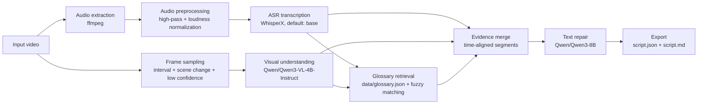

# ML-Project-group4 Project Presentation Script

Hello everyone. Today we would like to introduce our course project. This presentation has three parts: first, what we want to study; second, what we have done so far; and third, what we would like to improve in the future.

## 1. What We Want to Study

The question we want to study is: when the audio quality of a video is not ideal, or when the content contains many technical terms, can we improve the automatic speech recognition transcript by using additional information?

This problem comes from a common scenario. In meetings, lectures, interviews, or TED-style videos, an ASR model can usually produce an initial transcript. However, it may still misrecognize technical terms, names, organizations, or key words that appear on slides. If we only look at the audio, the system may not know how to correct these mistakes. But the video frames may contain subtitles, slide text, or other visual clues. We can also prepare a small domain glossary as background knowledge.

So our goal is not to claim that a model can fully and automatically fix every transcript. Instead, we want to explore a more practical question: if we combine low-confidence ASR results, visual information from the video, and a simple glossary, can these sources provide better evidence for later transcript repair?

## 2. What We Have Done

So far, we have mainly worked on three parts.

First, we prepared a small dataset. The dataset is stored under the `data/` directory. It contains 10 TED or TED-Ed video samples related to artificial intelligence and machine learning. For each sample, we organized the video file, extracted audio, manually collected reference transcript, metadata, and several background documents for RAG. The dataset is small, but it is enough for us to run the pipeline and conduct initial experiments.

Second, we implemented a command-line pipeline. The diagram below shows the main workflow.

To explain this diagram: the pipeline starts from an input video. We first extract and preprocess the audio, then use WhisperX for ASR transcription. At the same time, we sample frames from the video, especially around scene changes and low-confidence ASR segments. These frames can be sent to a vision-language model for visual evidence. We also use a local glossary for lightweight RAG-style term retrieval. Finally, we merge ASR, visual, and glossary evidence by timestamp, and then use a text model to generate a repaired transcript. The result is exported as both JSON and Markdown.

More specifically, the models and tools we currently use, or set as defaults, are:

- ASR: WhisperX, with `base` as the default model size. It can also be changed to `tiny`, `small`, `medium`, or `large`.
- Speaker diarization: optional pyannote-based models through WhisperX. This requires the corresponding HuggingFace access or token.
- Visual understanding: `Qwen/Qwen3-VL-4B-Instruct`, used to analyze sampled frames, visible text, scenes, and possible technical terms.
- Text repair: `Qwen/Qwen3-8B`, called through an OpenAI-compatible API. It uses ASR output, visual evidence, and RAG hits to produce the repaired text.
- RAG: this part is not a real vector model yet. For now, it uses the local `data/glossary.json` file plus fuzzy matching as a lightweight term retrieval module.

In other words, the lightweight command `make run` can skip the visual model and text repair model, so we can first verify audio processing, ASR, frame sampling, glossary retrieval, and export. The full command `make run-full` is used when we want to connect Qwen3-VL and Qwen3-8B through model APIs.

Third, we organized the engineering structure. The core modules are under `src/agent/`. Each module is responsible for one step, such as audio processing, ASR, frame sampling, RAG retrieval, evidence merging, text repair, and export. We also provide a CLI and a Makefile, so the project can be started more easily. The final results are exported as `script.json` and `script.md`, which makes them easier to inspect and evaluate.

It is important to be realistic about the current stage. This is still a prototype system. The RAG module is currently a local JSON glossary, not a real vector database. The full visual understanding and text repair steps depend on external or local model APIs. The project does not have a web interface, and we have not completed large-scale experiments yet. So we see it as an experimental framework that has been built, not as a mature application.

## 3. What We Want to Do Next

Next, we want to improve the project in three directions.

First, we want to build a clearer evaluation process. Since we already have ground truth transcripts, we can compare the original ASR output with the repaired output. For example, we can measure word error rate, technical term accuracy, and whether the segments marked for review are actually the ones that are more likely to contain errors. This will help us judge whether the pipeline is truly useful.

Second, we want to improve RAG and evidence usage. The current glossary retrieval is simple. In the future, we can connect a real vector database and include more background information, such as video topics, speaker background, technical vocabulary, and slide content. At the same time, we need better rules to avoid over-correcting the original transcript when the evidence is not strong enough.

Third, we want to improve the project form. For example, we can add batch processing, support more export formats such as SRT or VTT subtitles, and improve speaker diarization. If time allows, we can also turn the current sequential pipeline into a clearer Agent workflow, which would make debugging and extension easier.

To summarize, our project studies whether visual information and background knowledge can help repair video transcripts when ASR makes mistakes. So far, we have prepared a small dataset, implemented the basic pipeline, added command-line startup support, and exported structured results. Our next focus will be evaluation, stronger retrieval, and better engineering.

Thank you.
